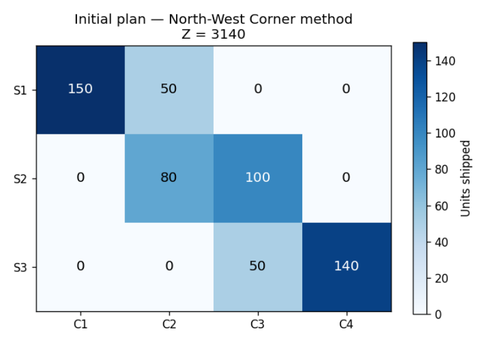
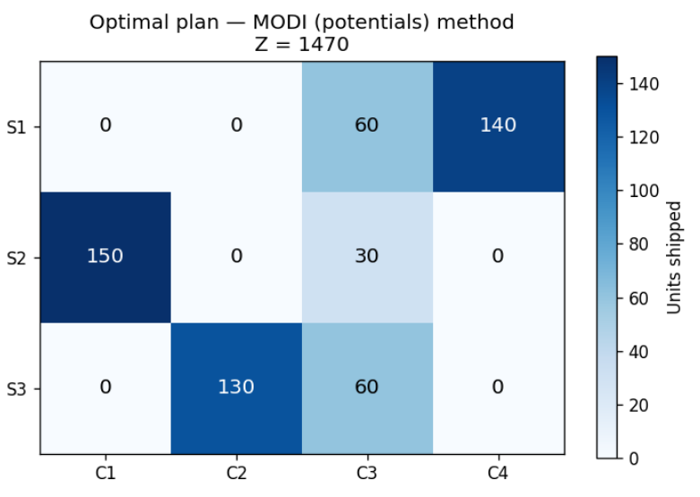
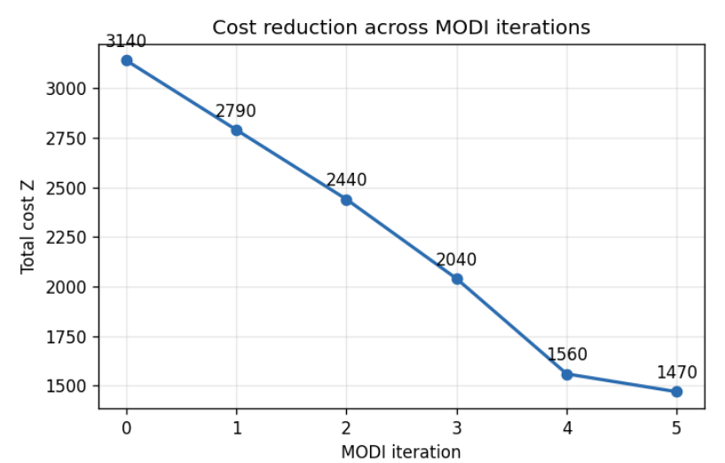

# Transportation Problem Solver — North-West Corner + MODI Method

A from-scratch implementation of the classical transportation (logistics) optimization problem: building an initial feasible plan and iteratively improving it to the cost-minimal solution using the method of potentials (MODI).

## About the project

Given a set of suppliers with fixed supply, a set of consumers with fixed demand, and a cost matrix for shipping one unit between each supplier–consumer pair, the goal is to find the shipment plan that minimizes total transportation cost.

**What was implemented:**
- Automatic balancing of unbalanced problems (adding a dummy supplier/consumer with zero cost when total supply ≠ total demand)
- Two methods for building an initial feasible plan: **North-West Corner** and **Minimum Element (lowest cost cell)**
- Degenerate-basis handling: ensuring the basis always has exactly `m + n − 1` cells before optimization
- The **method of potentials (MODI)**: computing potentials `u, v`, reduced costs, selecting the entering cell, building the closed loop (cycle) for recalculation, and updating the plan iteration by iteration until optimality
- Manual or random input mode for cost matrix, supply, and demand
- A correctness check against `scipy.optimize.linprog` on a reference example

**Correctness:** the algorithm's result was independently verified against `scipy.optimize.linprog` on multiple randomized test cases and matched the true optimum exactly in every feasible case.

## Example run

For the reference example (cost matrix, supply `[200, 180, 190]`, demand `[150, 130, 150, 140]`):

```
Тарифы C:
    7   8   1   2
    4   5   3   8
    9   2   3   6

Запасы a: [200, 180, 190]
Потребности b: [150, 130, 150, 140]

Начальный план (северо-западный угол):
  150   50    0    0
    0   80  100    0
    0    0   50  140
Z_нач = 3140

--- Оптимизация методом потенциалов ---
...
Z_min = 1470
```

## Visualizations

**Initial plan (North-West Corner method)**



**Optimal plan (after MODI optimization)**



**Cost reduction across MODI iterations**



> Note: the source notebook only prints results as text; these charts were generated separately by running the algorithm on the notebook's own reference example, to visualize the optimization process.

## Repository structure

```
├── transportation_task.ipynb   # main notebook (North-West Corner + MODI)
├── *.png                       # visualizations used in the README
└── README.md
```

## Stack

`Python` · `numpy` · `scipy` (for verification only) — core algorithm implemented from scratch with plain Python

## How to run

1. Clone the repository
2. Open `transportation_task.ipynb` in Jupyter Notebook / Google Colab
3. Install dependencies: `pip install numpy scipy`
4. Run the cells; when prompted, choose `manual` to enter your own cost matrix, supply and demand, or `random` to generate a random balanced problem
